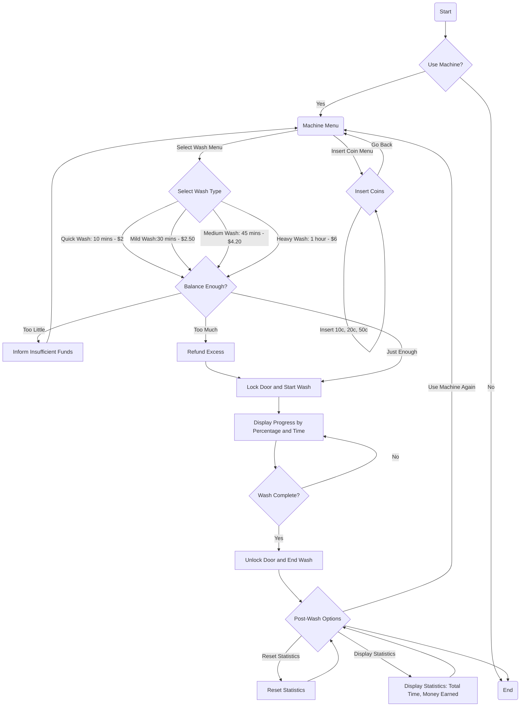

```mermaid
flowchart TD
    A(Start) --> B{Use Machine?}
    B -->|No| End(End)
    B -->|Yes| C(Machine Menu)

    C -->|Insert Coin Menu| E{Insert Coins}
    C -->|Select Wash Menu| SW{Select Wash Type}
    E -->|Insert 10c, 20c, 50c| E
    E -->|Go Back| C

    SW -->|Quick Wash: 10 mins - $2| D
    SW -->|Mild Wash:30 mins - $2.50| D
    SW -->|Medium Wash: 45 mins - $4.20| D
    SW -->|Heavy Wash: 1 hour - $6| D

    D{Balance Enough?}
    D -->|Too Little| F[Inform Insufficient Funds]
    F --> C
    D -->|Too Much| G[Refund Excess]
    G --> H[Execute Wash]
    D -->|Just Enough| H[Lock Door and Start Wash]

    H --> I[Display Progress by Percentage and Time]
    I --> J{Wash Complete?}
    J -->|Yes| K[Unlock Door and End Wash]
    J -->|No| I

    K --> L{Post-Wash Options}
    L -->|Display Statistics| M[Display Statistics: Total Time, Money Earned]
    L -->|Reset Statistics| N[Reset Statistics]
    L -->|Use Machine Again| C
    M --> L
    N --> L
    L --> End(End)
```
